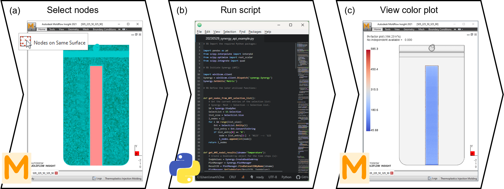

# fAplotter: Example script for creating *User-Defined Plots* in Autodesk Moldflow Insight using Python

`fAplotter.py` is a simplified Python code extract developed for the publication [*"Influence of Injection Molding Parameters on the Peel Strength between Plasma-Treated Fluoropolymer Films and Polycarbonate"*](https://www.mdpi.com/2206850). There, in equation (1), the temperature-time integral $f_A$ (K∙s), was defined.

In this paper, the bonding between $O_2$ plasma-treated fluoropolymer THV-films overmolded with polycarbonate (PC) through injection molding was investigated. The adhesion strength obtained experimentally in the peel tests could be correlated with the injection molding simulations carried out with the commercial software Autodesk Moldflow Insight (AMI) through the $f_A$.

`fAplotter.py` uses an already-run AMI analysis to calculate the $f_A$ for all selected nodes (*Selection List*), to create the corresponding *User-Defined Plot*.

### Dependencies
* [Autodesk Moldflow Insight](https://www.autodesk.com/products/moldflow/overview)
* [Python](https://www.python.org/)
* [pandas](https://pandas.pydata.org/)
* [scipy](https://scipy.org/)

The script has been tested on `AMI 2019`, `Python 3.7`, `pandas 1.3.5`, and `scipy 1.7.3` and may not work on other versions.

### Quick start

An AMI *Study* with a previously run *3D analysis* (*fill* or *fill+pack*) must be available. For example, the file `ami_study.sdy` can be used after running the analysis.

Then the nodes for which $f_A$ should be calculated must be selected in AMI's user interface *Synergy* (Figure 1a).
Next, the `fAplotter.py` file is run (Figure 1b) either in a command window or by double-clicking. Note that, as with *VBS macros*, the relevant *Synergy* session must be the first window opened, and the respective *active study* must remain open while the Python script is running.

Finally, once the script has been completed, a *User-Defined Plot* showing the calculated $f_A$ for the selected nodes is created in *Synergy* (Figure 1c).

Figure 1: The (surface) nodes to be examined are selected (<i>Selection List</i>) in AMI's user interface <i>Synergy</i> (<b>a</b>), and the Python script is run (<b>b</b>) to obtain the $f_A$ for each node as a <i>User-Defined Plot</i> color plot (<b>c</b>).

